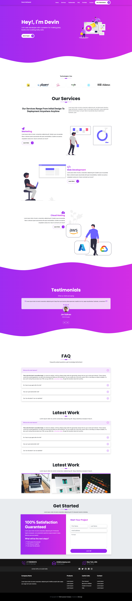

# Styling a webpage with Bootstrap 5 and SASS

This is a basic website created using Bootstrap 5. This project is focused on developing my skills creating larger designs with Bootstrap, using more advanced build tools such as npm and the command line, and learning SASS/SCSS.

## Getting Started

You can access the website by clicking on the following link: https://dashing-manatee-eab6fb.netlify.app/

## Screenshot

## Features

The website provides information about the project and its mission. It also includes the following features:

- Mobile-first responsive design 
- Semantic html for accessibility
- Interactive galleries and modals

## Technologies Used

The website is built using the following technologies:

- HTML
- CSS/SCSS
- JavaScript
- Netlify

## Continuous Improvement

- Learn how to deploy to Github Pages
- Clean up file structure

